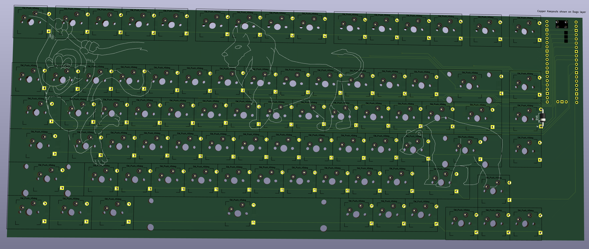

| title | Author | description | created_at |
|--|--|--|--|
| NormalPad | Nathan Tsai | A 75% Keyboard w/82 Silent tactile switches | 2024-12-24|

Time spent: ~30-40 hours total

*Note: Although I started this project for Hackpad v2, I never got around to finishing it until recently. At this point, I had finished the main CAD, a relatively finished BOM and main PCB, which probably took around 20-30 hours of time - I redid the CAD case 2-3 times, as I didn't like the design structure and it didn't fit the pcb, and the PCB layout took a while since I rewired the copper multiple times. 

*Another note: I didn't keep good track of my time while creating my project, so it might be very inaccurate.

## June 24th: Checking PCB
Since I had finished my PCB, I thought about checking the PCB to make sure each part fit. I checked the BOM, and realized that although the Kailh hot swap keys and stabilizers seemed to fit, the diodes were the wrong size. Apperantly I had used D-35 7.62mm resister footprint but I wanted to buy D-41 10.16mm as they came in for a relatively good price($5 for 100pc at Amazon). Thus I found the right footprint after spending a lot of time trying to match the 7.62mm diode, and exploring SMD options to assemble at JLCPCB instead of soldering it myself. Eventually I realized that this was a waste of time, as I could have taken a different footprint - the D-41 10.16mm one, which I found after searching the Kicad library multiple times. 

Time: ~2 Hours

<b>One switch but this process with 82 keys instead of one as pictured here</b>

## June 25th: Checking validation between whole project
Since I had finished my project, I wanted to make sure that the whole project was going to be ok. First, I checked the CAD design. I realized that there weren't any supports, so i added a 0.4mm unstable support for the bottoms of the cad case that hopefully doesn't fall apart during printing for the case - fingers crossed! Then I checked the BOM for anything that seemed off. There didn't seem to be anything off, but I was really confused about how the shipping worked. Time to take a break!

Time: ~2-3 Hours

<b>the supports</b> - Basically I split the bottom keyboard in half to make it easier to find people who could print the full size keyboard

## June 26th: Frantically checking shipping prices
I had forgot about CAD shipping until yesterday. I haven't used USPS before, but I checked their website to see how much shipping would cost. It took a while to find their Priority Mail page where I found it would cost around $10.75 for shipping. I'm still hesitant on that number, though, as the package could be bigger than expected or the mail people might upcharge. Otherwise, it should be fine. The most annoying part, though, was trying to convert the keyboard dimensions from mm to inches, where I used a number converter. I kept forgetting the numbers as there were too many and I guessed some of them(4 - length, width, height, and weight)

Trying to sift through a bunch of words I don't understand. I figured out what the zones meant though, and that my package might cost more than the average CAD design.

Time ~1-2 hours

## June 27th: Finishing up project
I realized that my split bottom was more of a hassle than an asset, so I spent some time combining it. I also finished the README, taking a lot of pictures, which was kind of annoying.

Time: ~1-2 hours

The amount of pictures I added to the README(excluding ~5 pictures)

*Sidenote: My computer insisted upon deleting random files, and Onedrive complained that I should upload my precious files into its tiny 5 GB cloud storage. I clicked ok, and now my files are messed up :(

## June 28th: Billing issues
Originally, I had planned to get a lot of parts from Amazon as the prices were actually and looked more reliable than Aliexpress. However, I had seen that they had charged me $20 in unknown price fees, shipping not included. I took a while trying to source parts from different sources than Amazon, which actually was annoying as I wanted to lower the price but keep the quality of my products. Sadly, I took out my durock silent t1 shrimps key switch from the BOM to lower the overall cost. The switches and stabilizers went from MechanicalKeyboards to Milktooth to Aliexpress and a few more. I wasn't happy with Amazon, as they hid their end prices(price with tax and shipping), so nothing on the BOM is from them. 

I added the keycaps to show the final project, which took a lot of time

Other than that, I checked the Highway submission guidelines and cleaned up the project

Time: 3-5 hours

## July 1st: fixing problems
I changed the bottom cad design, the BOM and added the pcb step files to the cad folder

Time: 1-2 hours

## July 5: fix problems
added more designs

## July 8th: Ordering parts
I started ordering parts. However, I realized that the stabilizers were more expensive than previously though and so I had to change both the stabilizers and the store as the one I had in mind was sold out on the original website and also more expensive on every single other. 
While ordering my stabilizers, the order was reversed. 3 times. I ended up ordering the Durock stabilizers from Mechanical Keyboards.
I also updated the BOMs for more accuracy
Time: 2-4 hours

## 11/22/25: everything but sped up
I forgot to log for the past few months bc everything was really slow. I got all the parts, but realized the hole in the case wasn't the size I wanted. I tried to get some screws from Aliexpress (never arrived) and now am wondering whether I should get 50 from Digikey rn. 
I also soldered everything together, which was a pain. I soldered some in the wrong directin, and one of them wasn't soldered.
The software came along nicely, so the keyboard registers a click and can assign it the right letter. I haven't put on the keycaps yet. I had to use anthropic to debug that I was using high/low pins and not input_pullup/input / output, and switched the rows and columns.
Overall, I'm happy to see how this turned out, my CAD design looks finished, and that it seems like a good build to build. 
Time:12-24 hours