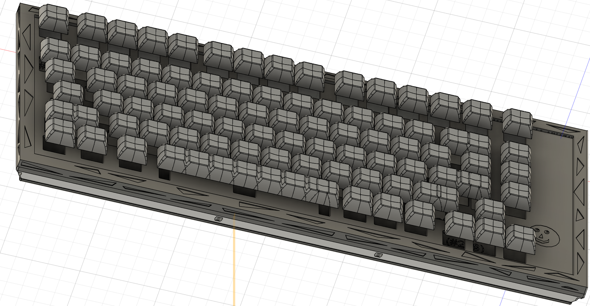
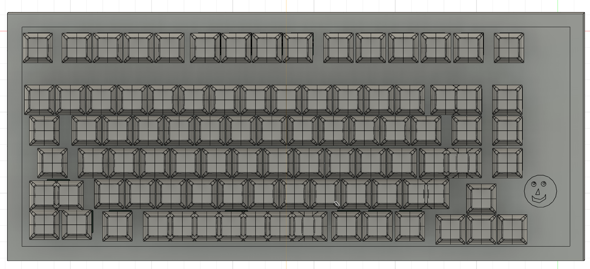

# NormalPad

*Note: this is a hackboard, not a hackpad
## What is this?
This is a 75% keyboard inspired by the [Keychron Q1 Custom Keyboard](https://www.keychron.com/products/keychron-q1?srsltid=AfmBOorYcrgbMnQshTxcVkn31a3YPq6My79lAXlqjA35xHALWIpRg0Ld). It consists of 82 keys, hot-swappable switches a 3D printable case, and stabilizers. The bottom half is split in half to make it easier to sand

## Quick overview of repo
+ cad
    1. full_keyboard.stl
+ firmware
    1. normalPad.ino
+ pcb
    1. hackpad_v2.kicad_pcb
    2. hackpad_v2.kicad_prl
    3. hackpad_v2.kicad_pro
    4. hackpad_v2.kicad_sch
+ production
    + cad(stl)
        1. plate.stl
        2. upper_ex.stl
        3. bottom.stl
    1. normalPad.ino
    2. gerbers-zip.zip
+ src
    1. angle_bottom.png
    2. assembled_bottom.png
    3. bottom.png
    4. diagram.png
    5. pcb.png
    6. plate.png
    7. schem.png
    8. side_short.png
    9. side_long.png
    10. together.png
    11. top_plate.png
+ README.md
+ bom.csv
+ JOURNAL.md

*The more important files are contained in the production folder, README, and bom(in a ccsv file and at the end of this page)
## Why did I make this
I primarily started this for [HackPad v2](https://hackpad.hackclub.com/keyboard). However, during the process of making this, I learned more about the different types of switches, stabilizers, splitting up CAD designs into multiple parts, and all the parts of the keyboard. I learned a little bit more about the [Arduino Keyboard library](https://docs.arduino.cc/language-reference/en/functions/usb/Keyboard/), how to write relatively efficient code, and organize my pcb schematic and pcb in a larger scale than what I previously learned. As I had taken a break for a few months from my original keyboard design, I had stopped 

## Pictures of my design:
### Schematic:
<b>My diagram, which depicts the row and column numbers</b>

<b>The schematic for the pcb, relatively organized in the order wanted</b>

### PCB
<b>My PCB</b>

<b>PCB back</b>

<b>PCB front (w/key switch side)</b>

### CAD Case(Disassembled)
From top to bottom 

<b>Top plate</b>

<b>Plate</b>

<b>Bottom</b>

### CAD case(relatively assembled)

<b>Assembled case</b>

<b>Side analysis of case</b>

<b>sketch of monkey/face added to project</b>

## Bill of Materials
Also see [here](./BOM.csv)
|mfg name|	            Description|	        Price|	shipping|	total|
| ---|                          ---|              ---|      ---|     ---|
|ALIEXPRESS|	        [keycap set + welcome deal](https://www.aliexpress.us/item/3256803996370867.html?spm=a2g0o.productlist.main.10.ced79Pkf9PkfdZ&algo_pvid=a2de231f-765f-412a-a354-46d2371350f9&algo_exp_id=a2de231f-765f-412a-a354-46d2371350f9-8&pdp_ext_f=%7B%22order%22%3A%22214%22%2C%22eval%22%3A%221%22%7D&pdp_npi=4%40dis%21USD%2126.29%214.40%21%21%2126.29%214.40%21%402101effb17511676367448407e122c%2112000040004000451%21sea%21US%216232956933%21ABX&curPageLogUid=FugDeouIzmlh&utparam-url=scene%3Asearch%7Cquery_from%3A)|	            7.23|	0.66|	    7.89
|ALIEXPRESS|	        [keyswitch(90)](https://www.aliexpress.us/item/3256807160745636.html?src=google&pdp_npi=4%40dis%21USD%215.60%214.93%21%21%21%21%21%40%2112000040360741619%21ppc%21%21%21&gQT=1&gRefinements=MERCHANT%3AAliExpress&gatewayAdapt=glo2usa)|	        25.17|	0|	        25.17
|ALIEXPRESS|	        taxes|	                3.37|	0|	        3.37
|NOVELKEYS|	            [stabilizer](https://novelkeys.com/collections/classic-bundle-stabilizers/products/tyeplus-stabilizers)|	            15|	    7.17|	    22.17
|DIGIKEY|	            [bolts(2Mx0.4 - 8mm*18)](https://www.digikey.com/en/products/detail/essentra-components/50M020040P008/11639927)|	1.76|	0|	        1.76
|DIGIKEY|	            [diode(84)](https://www.digikey.com/en/products/detail/comchip-technology/1N4001-G/1979654)|	            4.54|	0|	        4.54
|DIGIKEY|	            [Raspberry pi pico](https://www.digikey.com/en/products/detail/raspberry-pi/SC0915/13624793)|	    5|  	0|	        5
|DIGIKEY|	            [pin header 1x40](https://www.digikey.com/en/products/detail/amphenol-cs-commercial-products/G800W268018EU/17083164)|	    0.8|	0|	        0.8
|DIGIKEY|	            taxes+shipping|	        1.57|	4.99|	    6.56
|MECHANICALKEYBOARD|    [hot swap(90)](https://mechanicalkeyboards.com/products/kailh-switch-hot-swap-socket?variant=47416807194924&country=US&currency=USD&utm_medium=product_sync&utm_source=google&utm_content=sag_organic&utm_campaign=sag_organic&srsltid=AfmBOoruURlelfrpmfJ8_fzQfVlDKn0sQPwv330_qSdwBIp1Pz0PDX6dojQ&gQT=1)|	        9.9|   	5.8|	    15.7
|Total| |84.34| 18.62 | 92.96|

*PCB, and CAD case design not included

*PRICES IN USD
